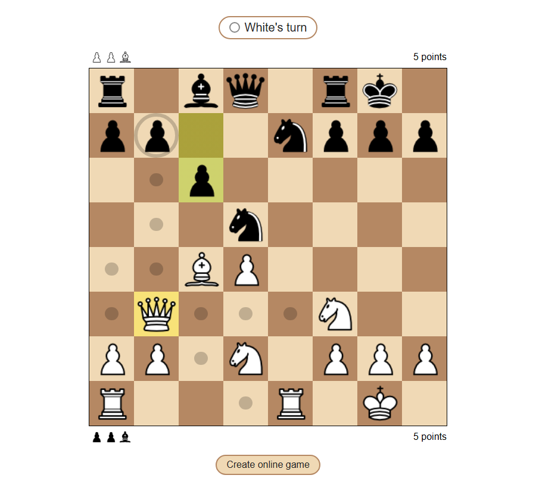
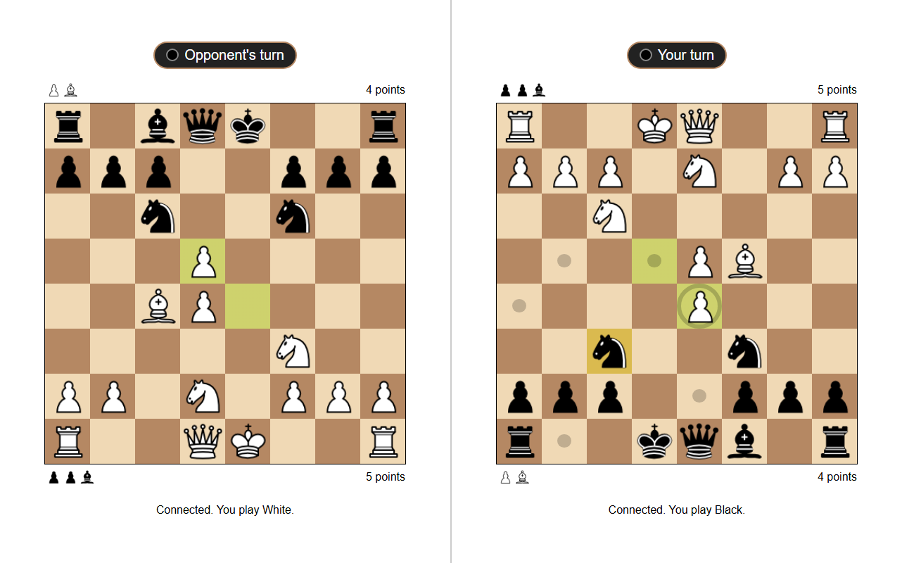

# Chess

A chess game made with plain HTML, CSS and JavaScript. You can play against a friend on the same computer, or send them a link and play online.

## Features

- All the normal chess rules, including castling, en passant and promotion
- Checkmate, stalemate and draw by insufficient material
- Move pieces by dragging them, or by clicking a piece and then a square
- Shows where the selected piece can move, the last move, and when a king is in check
- Captured pieces and points for each player (pawn 1, knight and bishop 3, rook 5, queen 9)
- Online games through a link

## Playing online

Click "Create online game" and send the link to the other player. You play white, and whoever opens the link plays black with the board turned around, so their pieces are at the bottom.

The two browsers connect directly to each other using [PeerJS](https://peerjs.com/). The page has to be hosted somewhere (GitHub Pages works fine) for the link to work for someone else.

If black reloads the page they can just open the link again and the game continues. If white reloads, the game is gone and a new one has to be created.

## Running it

Open `index.html` in a browser. There is nothing to install.

## Files

- `index.html`: the page and the board
- `chess.js`: the rules and everything that happens during a game
- `style.css`: the styling
- `pieces/`: the piece images
